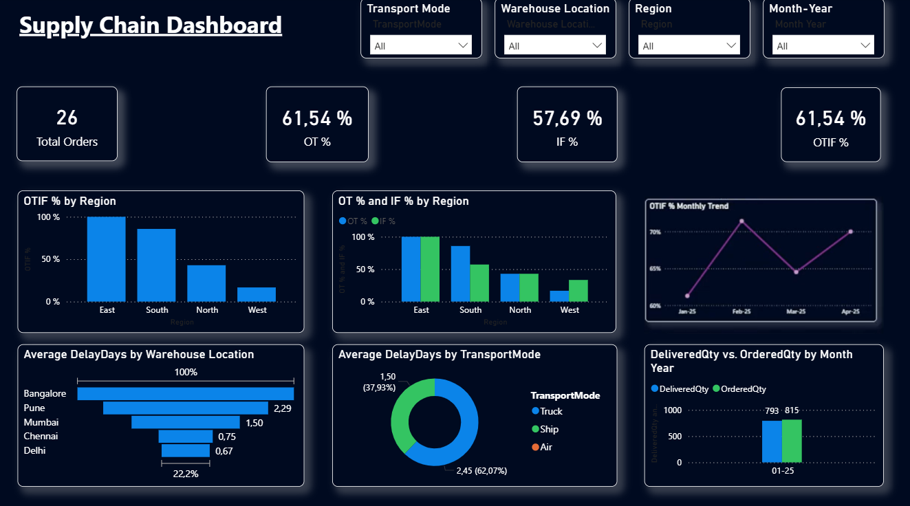

# Supply Chain Performance Dashboard

## 📊 Dashboard Overview
Welcome! This project features an interactive Power BI dashboard designed to monitor and optimize supply chain operations, focusing on delivery fulfillment and logistics efficiency.

## 🎯 Business Objectives & KPIs
The panel is built to support strategic decision-making by analyzing:
*   **Total Orders**: Tracking overall volume (26 orders in the current period).
*   **OTIF% (On-Time In-Full)**: A critical customer service level metric (currently at 61.54%).
*   **OT% & IF% Split**: Breakdown of on-time vs. in-full deliveries by region, highlighting that the **East** region leads performance while the **West** requires operational review.
*   **Delay Analysis (Average DelayDays)**: Identification of operational bottlenecks by warehouse location (e.g., Bangalore and Pune show the highest delays) and by **TransportMode** (**Air** vs. **Truck** and **Ship**).

## 🛠️ Tech Stack & Tools
*   **Power BI Desktop**: Data modeling, DAX measures, and UI/UX design utilizing a modern dark-mode theme.
*   **Logistics Channels**: Distribution analysis across Truck, Ship, and Air.

## 📂 Repository Structure
*   `Supply Chain Dashboard_2026.pbix`: The executable Power BI file.
*   `Supply Chain_example.csv`: The underlying dataset used for the analysis.
